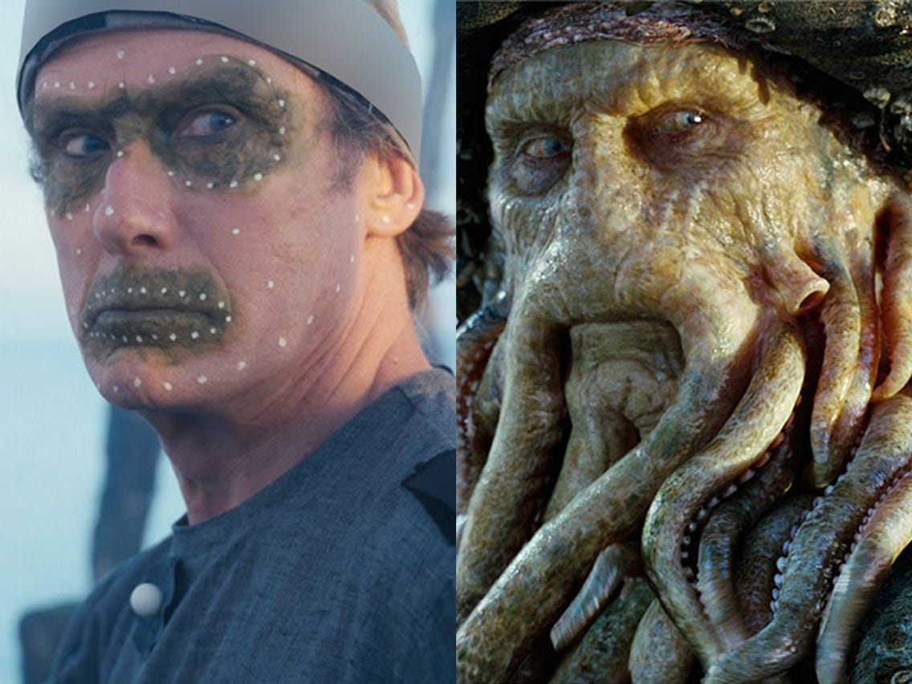
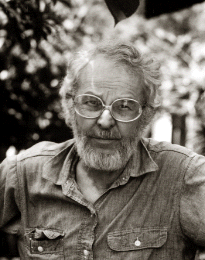
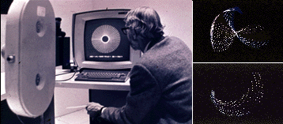
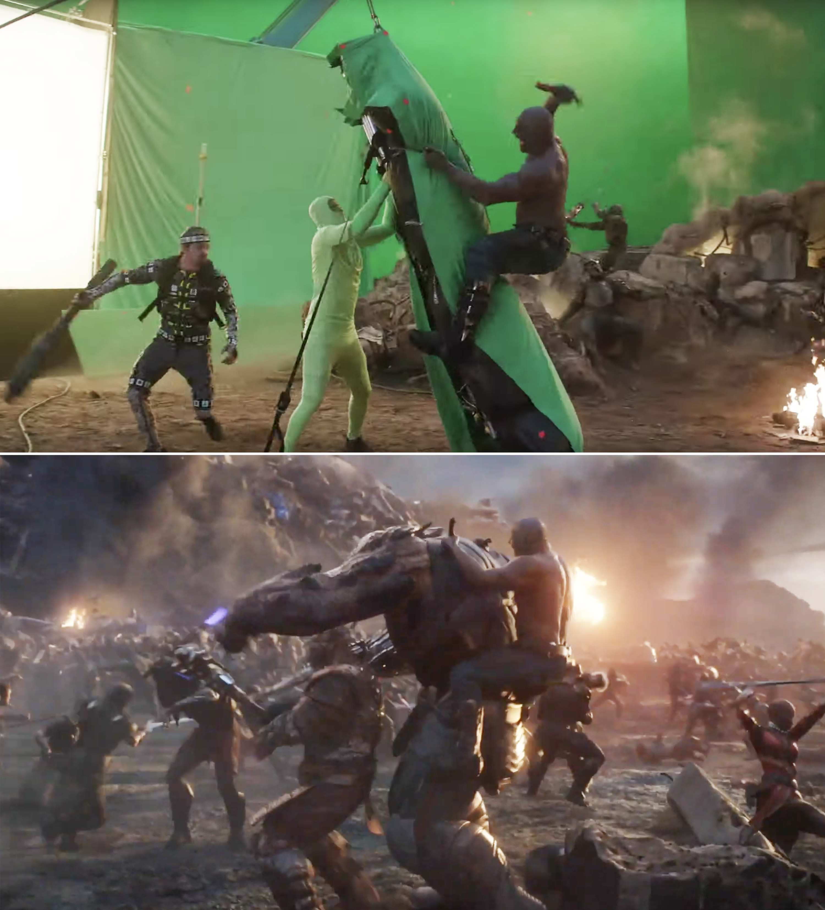

# Les effets numériques

*Effets spéciaux:*
Effets spéciaux cinématographiques à base de programmes informatiques d'animation et d'images de synthèse.

# L'histoire 
Les expérimentation avec l'animation à commencer dans les années 1940. John Whitney est l'un des premiers à utiliser les effets numériques.

 

# L'utilité
Cette technique sert à recréer des mouvements et des personnages, comme des intelligences artificielles.

# L'évolution

Le CGI a évolué et les cinéastes cherchait à l'utiliser dans leurs films.

# Logiciels

- Maya
- Bryce
- LightWave 3D 
- Blender
